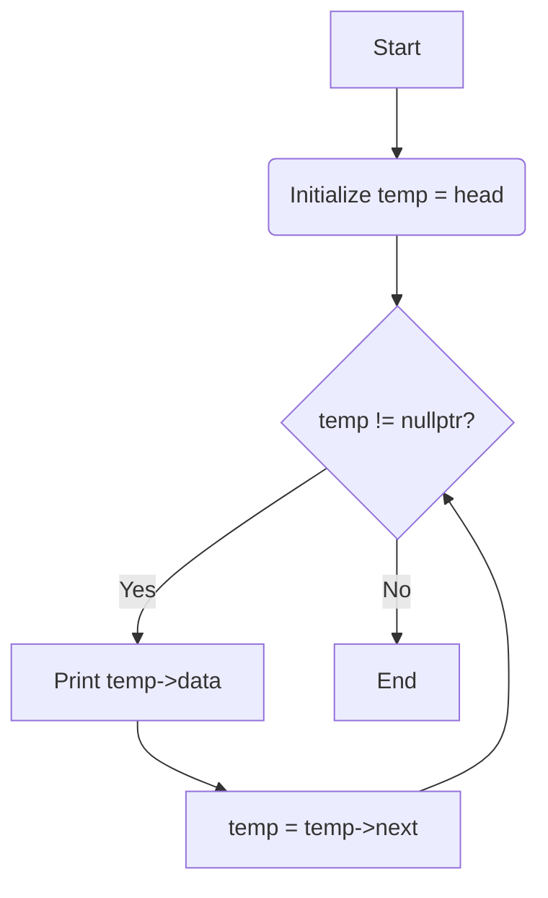
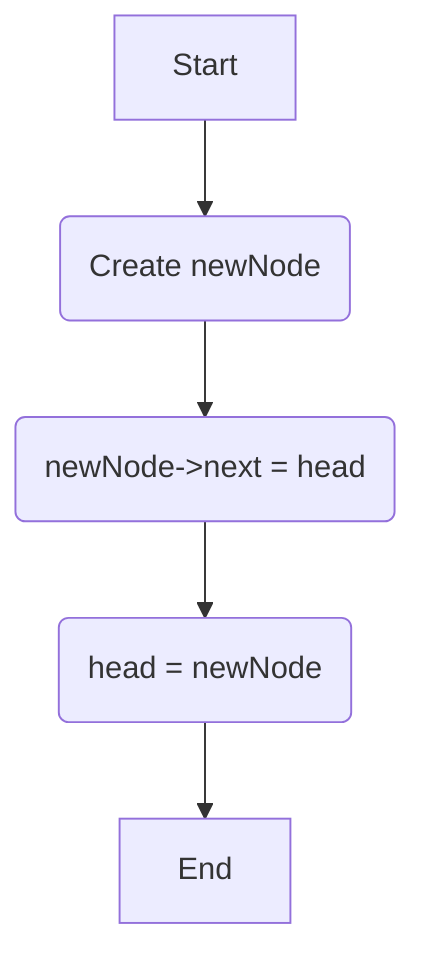
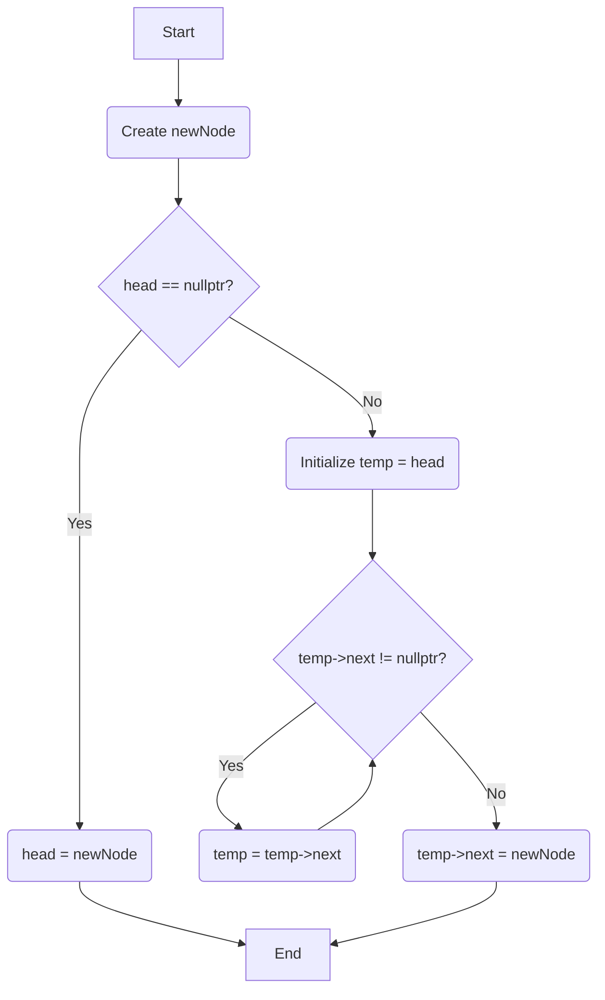
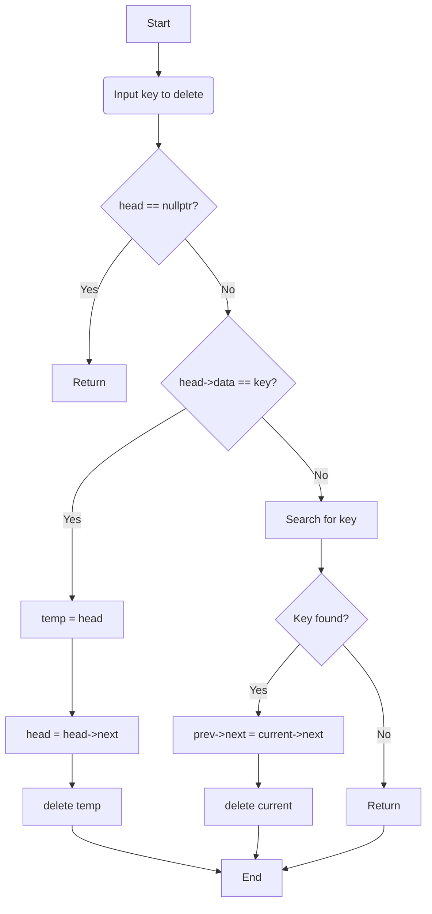

### 📚 Cpp\_Exp17\_Linked\_List: A Journey into Dynamic Data Structures

This repository serves as a comprehensive guide to understanding and implementing **linked lists** in C++. It covers fundamental concepts, core operations, and various types of linked lists to help you master this dynamic data structure.

-----

### 🎯 Aim

To study and implement the fundamental concepts and operations of linked lists, including creation, traversal, insertion, and deletion.

-----

### 💡 Theory: What is a Linked List?

A **linked list** is a linear data structure, much like an array, but it doesn't store elements in contiguous memory locations. Instead, each element, called a **node**, contains two parts:

1.  **Data:** The actual value or information.
2.  **Pointer (or link):** A reference to the next node in the sequence.

The last node in the list points to `nullptr` (or `NULL`), signifying the end of the list. The first node is called the **head**.

This structure allows linked lists to grow or shrink dynamically at runtime, making them highly flexible compared to static arrays.

### ⚙️ Core Operations & Algorithms

The following algorithms and flowcharts detail the most common operations performed on a singly linked list.

#### 1\. Traversal and Display

To traverse a linked list, you start at the `head` and follow the `next` pointer of each node until you reach `nullptr`.

**Algorithm:**

1.  **Start.**
2.  Initialize a temporary pointer, `temp`, to the `head` of the list.
3.  **Loop:** While `temp` is not `nullptr`:
      * Print the `data` of the current node (`temp->data`).
      * Move to the next node: `temp = temp->next`.
4.  Print a newline to end the output.
5.  **End.**

**Flowchart:**

#### 2\. Insertion at the Head

Inserting a new node at the beginning of the list is a straightforward process that involves updating the `head` pointer.

**Algorithm:**

1.  **Start.**
2.  Create a `new_node` with the given data.
3.  Set the `next` pointer of `new_node` to the current `head`.
4.  Update the `head` to point to the `new_node`.
5.  **End.**

**Flowchart:**

#### 3\. Insertion at the Tail

To insert a new node at the end of the list, you must first traverse to the last node.

**Algorithm:**

1.  **Start.**
2.  Create a `new_node` with the given data.
3.  **Check:** If the `head` is `nullptr` (list is empty), set `head = new_node`.
4.  **Else:**
      * Initialize a `temp` pointer to `head`.
      * **Loop:** Traverse to the last node: While `temp->next` is not `nullptr`, set `temp = temp->next`.
      * Set the `next` pointer of the last node to `new_node`: `temp->next = new_node`.
5.  **End.**

**Flowchart:**

#### 4\. Deletion of a Node

Deleting a node requires finding it, updating the pointers of the surrounding nodes, and then freeing the memory.

**Algorithm:**

1.  **Start.**
2.  Read the `key` (data) of the node to be deleted.
3.  **Check:** If the `head` is `nullptr` (list is empty), return.
4.  **If `head` is the node to delete:**
      * Initialize a `temp` pointer to `head`.
      * Update `head = head->next`.
      * Delete `temp`.
5.  **Else (search for the node):**
      * Initialize `current` and `prev` pointers to `head` and `nullptr`, respectively.
      * **Loop:** While `current` is not `nullptr` and `current->data` is not `key`:
          * Set `prev = current`.
          * Set `current = current->next`.
      * **Check:** If `current` is `nullptr` (key not found), return.
      * Set `prev->next = current->next`.
      * Delete `current`.
6.  **End.**

**Flowchart:**

-----

### 🚀 Why Use Linked Lists?

| Aspect | Linked List | Array |
| :--- | :--- | :--- |
| **Dynamic Size** | Can grow and shrink dynamically; no need to pre-allocate. | Static size; fixed at compile time (or requires resizing). |
| **Memory Usage** | Nodes can be scattered; requires extra space for pointers. | Contiguous memory blocks; efficient space utilization. |
| **Insertion/Deletion** | Fast (O(1)) at the head; O(n) for other positions. | Slow (O(n)) as elements need to be shifted. |
| **Random Access** | Slow (O(n)); requires traversal from the head. | Fast (O(1)); direct access via index. |

Linked lists are particularly useful for implementing data structures like **stacks**, **queues**, and **graphs**. They excel in scenarios where the number of elements is unknown beforehand or where frequent insertions and deletions are required.
